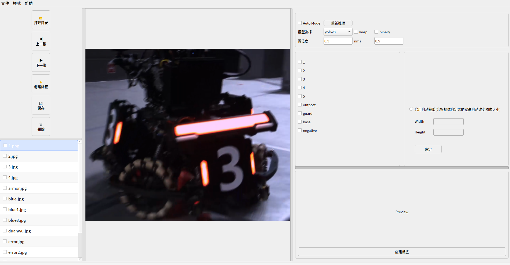
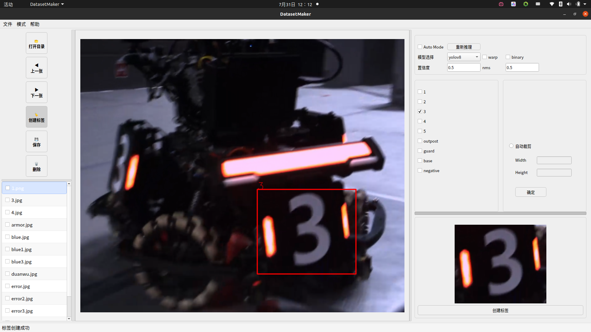
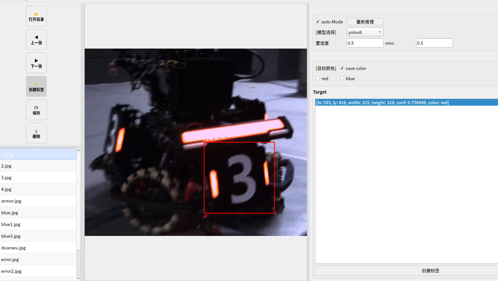
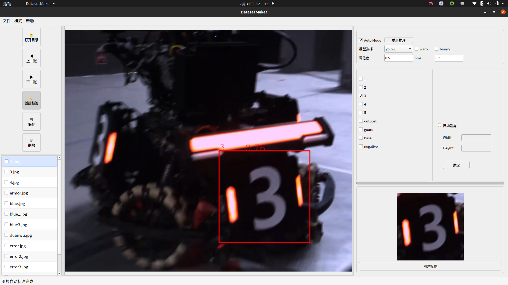

# RoboMaster数据集自动标注工具

目前仅支持装甲板分类和装甲板检测，yolo格式的数据集制作

如果发现bug或有什么建议，可以邮箱联系我：743648056@qq.com

## 使用说明

### 通用

打开图片文件夹后，同时满足打开标签模式和选择标注模式后，即可正常使用

鼠标点击拖动绘制框直至释放，即可创建一个临时标签（绿色）

确认后点击创建标签，即可创建一个确定标签（蓝色）

在图像中点击标签即可选中（红色），此时可以对标签内容进行修改

（自动模式会自动创建确定标签，无需手动创建）

可点击保存按钮，选择标签保存路径后保存，或者在上一张下一张时也会自动保存

### cls

1.Auto Mode：开启后会自动对每张新的图片启用自动标注（当前使用的模型比较简陋，注意甄别）

2.warp：自动矫正类别图片（需要先开启自动模式，生效条件较苛刻，仅推荐车上录的bag使用）

3.binary：对保存的图片进行二值化

4.自动裁剪：会在保存时自动矫正图片大小为自定义大小

### detection

1.save color：开启后保存的标签会根据颜色分类（blue armor和red armor）

2.save Label：开启后会同时保存标签图片（同cls模式），其余功能同cls（未开启save Label时无法启用）

3.pose Mode：不再是拖动鼠标绘制，点击装甲板四角点位置即可，按下第四个点时自动创建标签，无需手动确认（该功能的自动标注不咋好使，手标比重较高）

4.如果快捷键失效可以检查一下焦点

## 快捷键

### 通用

| 打开文件                                                     | ctrl + O                  |
| :----------------------------------------------------------- | :------------------------ |
| **上一张**                                                   | **A**                     |
| **下一张**                                                   | **D**                     |
| **标签模式**                                                 | **ctrl + L**              |
| **保存**                                                     | **ctrl + S**              |
| **删除**                                                     | **ctrl + D**              |
| **创建标签**                                                 | **Enter**                 |
| **删除标签（需选中标签或存在临时标签）**                     | **双击 Delete/Backspace** |
| **取消标签绘制（需在鼠标释放前，pose模式则为绘制第四点前）** | **Esc**                   |

### cls 

| 1            | 1     |
| :----------- | ----- |
| **2**        | **2** |
| **3**        | **3** |
| **4**        | **4** |
| **5**        | **5** |
| **outpost**  | **6** |
| **guard**    | **7** |
| **base**     | **8** |
| **negative** | **9** |

### detection

| red      | Q     |
| -------- | ----- |
| **blue** | **E** |

标签的快捷键同cls

## 更新日志

#### **v1.1.0**

1.新增了detection模式的pose模式，已提供准确的四点标注

2.新增了detection模式的保存label功能，现在可以同时进行装甲板和装甲板类别的标注了

#### **v1.0.2**

1.修复了未打开图片时选择标注模式会闪退的bug

2.修复了删除标签文件时无法再创建临时标签的bug

3.修复了对已处理图片进行二次自动标注的bug

#### **v1.0.1**

1.修复了几个闪退问题

2.添加修改保存路劲按钮

3.现在存在临时标签时会取消标签选择，默认删除键为删除临时标签

4.现在图像上的字体大小会根据图像大小调整
